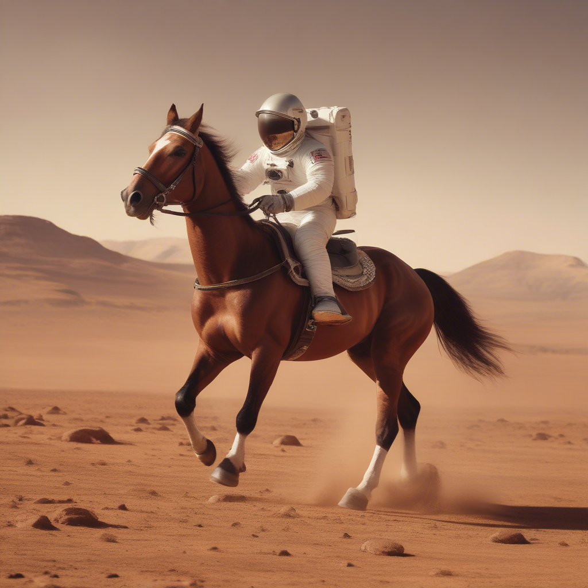
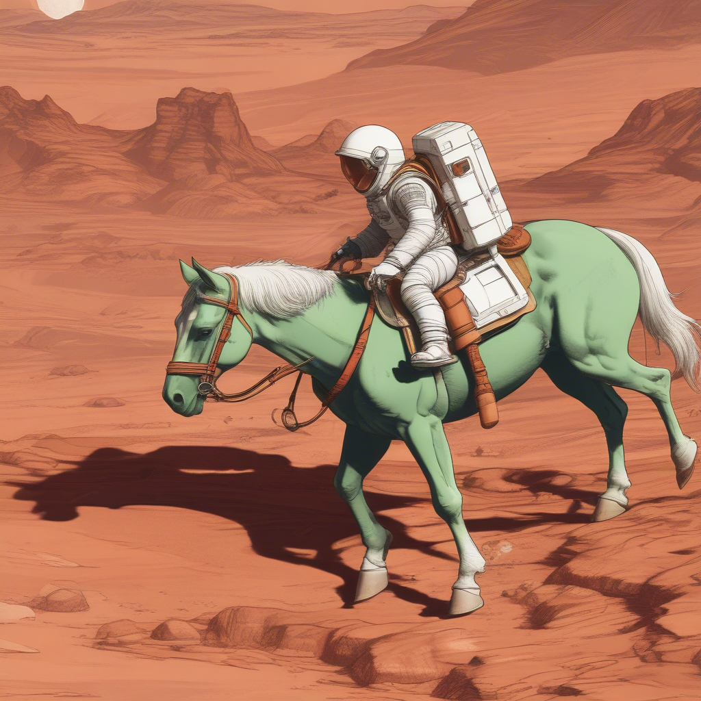
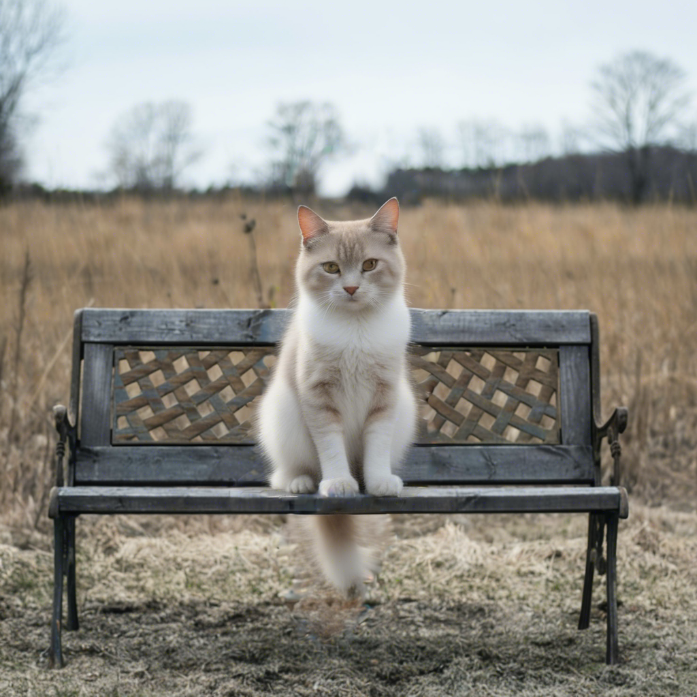
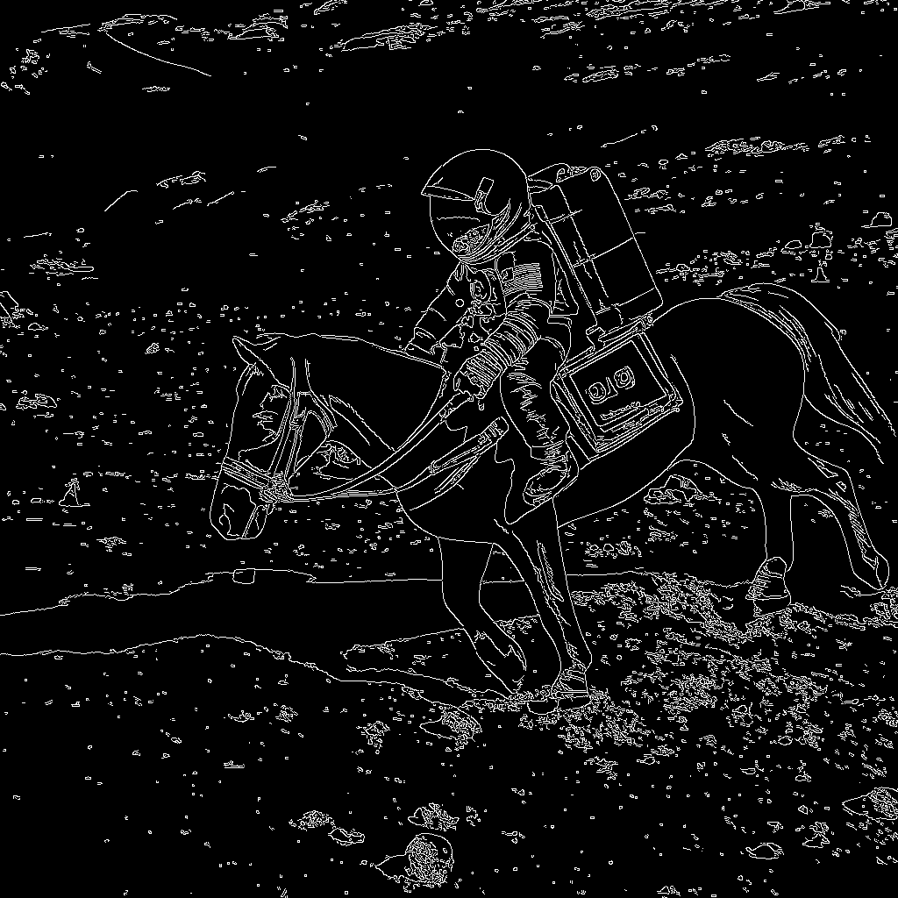
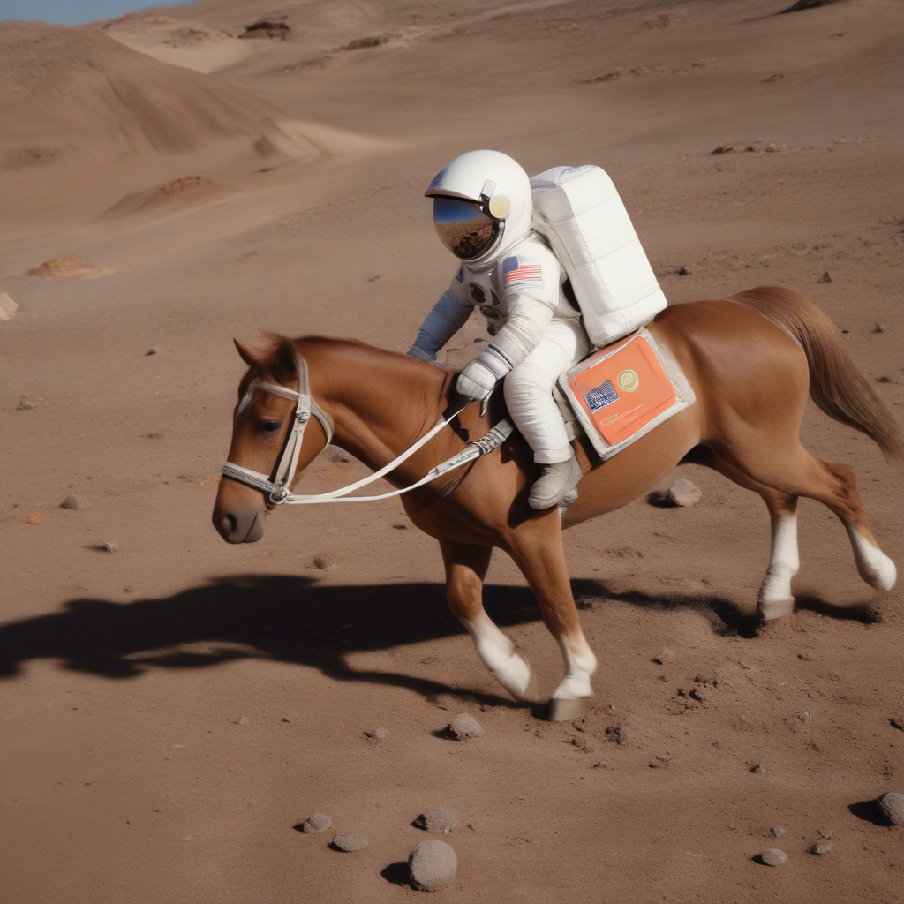
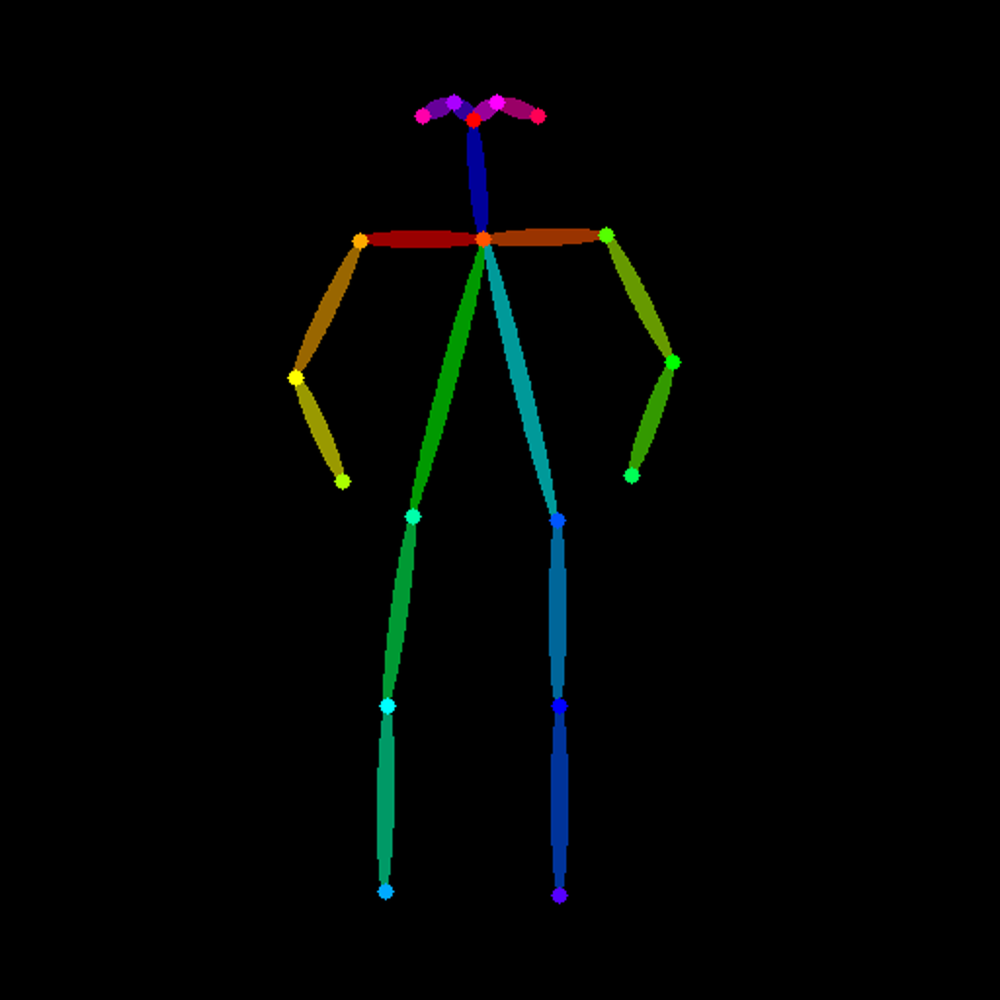
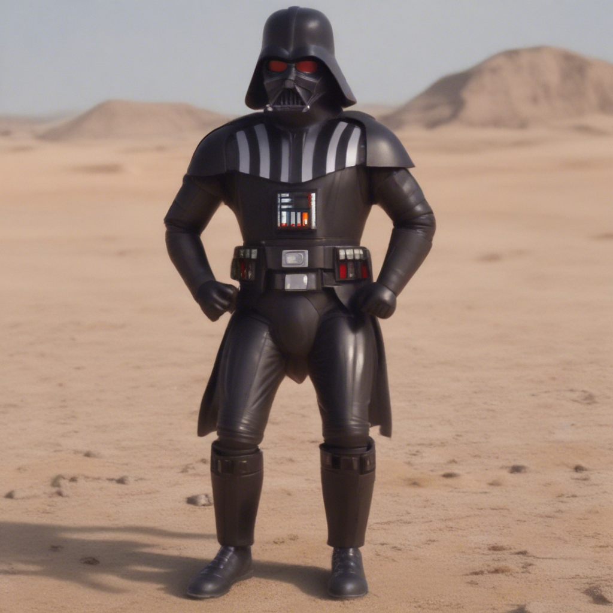

# Diffusers Core ML

## Tested on

|       Device       | macOS  | Python | coremltools |
|:------------------:|:------:|:------:|:-----------:|
| MacBook Air M3 16G |   14.5 |  3.9   |     7.2     |

## Performance

|          Model           | Quantization | Compute Unit | Latency(s) |
|:------------------------:|:------------:|:------------:|:----------:|
| [SDXL Lightning 4step](https://huggingface.co/ByteDance/SDXL-Lightning) |    6bits     | CPU_AND_GPU  |     15     |

## Supported Pipelines

- StableDiffusionXLPipeline
- StableDiffusionXLImg2ImgPipeline
- StableDiffusionXLInpaintPipeline
- StableDiffusionXLControlNetPipeline

## Not Supported

- LoRA

## Installation

```
pip3 install git+https://github.com/digitalbrain79/transformers-coreml.git
pip3 install git+https://github.com/digitalbrain79/diffusers-coreml.git
```

## Examples
Only supports 1024x1024 resolution
### Text to Image

```py
from diffusers import (
    EulerAncestralDiscreteScheduler,
    StableDiffusionXLPipeline
)

# Dreamshaper XL: digitalbrain79/dreamshaper-xl-lightning-4step-coreml-6bits-compiled
# Juggernaut XL: digitalbrain79/juggernaut-xl-lightning-4step-coreml-6bits-compiled
pipeline = StableDiffusionXLPipeline.from_pretrained(
    "digitalbrain79/sdxl-lightning-4step-coreml-6bits-compiled",
    use_safetensors=False,
    low_cpu_mem_usage=False
)

pipeline.scheduler = EulerAncestralDiscreteScheduler.from_config(
    pipeline.scheduler.config, timestep_spacing="trailing"
)

image = pipeline(
    prompt="a photo of an astronaut riding a horse on mars",
    num_inference_steps=4,
    guidance_scale=0
).images[0]
```



### Image to Image

```py
from diffusers import (
    EulerAncestralDiscreteScheduler,
    StableDiffusionXLImg2ImgPipeline
)
from diffusers.utils import load_image

pipeline = StableDiffusionXLImg2ImgPipeline.from_pretrained(
    "digitalbrain79/sdxl-lightning-4step-coreml-6bits-compiled",
    use_safetensors=False,
    low_cpu_mem_usage=False
)

pipeline.scheduler = EulerAncestralDiscreteScheduler.from_config(
    pipeline.scheduler.config, timestep_spacing="trailing"
)

url = "https://huggingface.co/datasets/patrickvonplaten/images/resolve/main/aa_xl/000000009.png"
init_image = load_image(url).convert("RGB")
image = pipeline(
    prompt="an astronaut riding a horse on mars, anime style",
    image=init_image,
    strength=0.9,
    num_inference_steps=4,
    guidance_scale=0
).images[0]
```



### Inpainting

```py
from diffusers import (
    EulerAncestralDiscreteScheduler,
    StableDiffusionXLInpaintPipeline
)
from diffusers.utils import load_image

pipeline = StableDiffusionXLInpaintPipeline.from_pretrained(
    "digitalbrain79/sdxl-lightning-4step-coreml-6bits-compiled",
    use_safetensors=False,
    low_cpu_mem_usage=False
)

pipeline.scheduler = EulerAncestralDiscreteScheduler.from_config(
    pipeline.scheduler.config, timestep_spacing="trailing"
)

img_url = "https://raw.githubusercontent.com/CompVis/latent-diffusion/main/data/inpainting_examples/overture-creations-5sI6fQgYIuo.png"
mask_url = "https://raw.githubusercontent.com/CompVis/latent-diffusion/main/data/inpainting_examples/overture-creations-5sI6fQgYIuo_mask.png"

init_image = load_image(img_url).convert("RGB")
mask_image = load_image(mask_url).convert("RGB")

image = pipeline(
    prompt="A cat sitting on a bench",
    image=init_image,
    mask_image=mask_image,
    strength=0.9,
    num_inference_steps=4,
    guidance_scale=0
).images[0]
```



### ControlNet
#### MistoLine
```py
import numpy as np
import cv2
from PIL import Image
from diffusers import (
    EulerAncestralDiscreteScheduler,
    StableDiffusionXLControlNetPipeline,
    ControlNetModel
)
from diffusers.utils import load_image

image = load_image(
    "https://huggingface.co/datasets/patrickvonplaten/images/resolve/main/aa_xl/000000009.png"
)

# Download manually "https://huggingface.co/digitalbrain79/mistoline-coreml-6bits-compiled"
controlnet_path = "" # Downloaded path

controlnet = ControlNetModel.from_pretrained(
    controlnet_path,
    use_safetensors=False,
    low_cpu_mem_usage=False
)

pipeline = StableDiffusionXLControlNetPipeline.from_pretrained(
    "digitalbrain79/sdxl-lightning-4step-controlnet-coreml-6bits-compiled",
    use_safetensors=False,
    low_cpu_mem_usage=False,
    controlnet=controlnet
)

pipeline.scheduler = EulerAncestralDiscreteScheduler.from_config(
    pipeline.scheduler.config, timestep_spacing="trailing"
)

image = np.array(image)
image = cv2.Canny(image, 100, 200)
image = image[:, :, None]
image = np.concatenate([image, image, image], axis=2)
canny_image = Image.fromarray(image)

image = pipeline(
prompt="a photo of an astronaut riding a horse on mars",
    controlnet_conditioning_scale=0.5,
    image=canny_image,
    num_inference_steps=4,
    guidance_scale=0
).images[0]
```

  

#### OpenPose
```py
from diffusers import (
    EulerAncestralDiscreteScheduler,
    StableDiffusionXLControlNetPipeline,
    ControlNetModel
)
from diffusers.utils import load_image
from controlnet_aux import OpenposeDetector

# Download manually "https://huggingface.co/digitalbrain79/controlnet-openpose-coreml-6bits-compiled"
controlnet_path = "" # Downloaded path

controlnet = ControlNetModel.from_pretrained(
    controlnet_path,
    use_safetensors=False,
    low_cpu_mem_usage=False
)
openpose = OpenposeDetector.from_pretrained("lllyasviel/ControlNet")

image = load_image(
    "https://huggingface.co/datasets/huggingface/documentation-images/resolve/main/diffusers/person.png"
)
openpose_image = openpose(image).resize((1024, 1024))

pipeline = StableDiffusionXLControlNetPipeline.from_pretrained(
    "digitalbrain79/sdxl-lightning-4step-controlnet-coreml-6bits-compiled",
    use_safetensors=False,
    low_cpu_mem_usage=False,
    controlnet=controlnet
)
pipeline.scheduler = EulerAncestralDiscreteScheduler.from_config(
    pipeline.scheduler.config, timestep_spacing="trailing"
)

image = pipeline(
    prompt="Darth vader dancing in a desert, high quality",
    negative_prompt="low quality, bad quality",
    image=openpose_image,
    num_inference_steps=4,
    guidance_scale=0
).images[0]
```

 

#### Depth
```py
import numpy as np
import cv2
from PIL import Image
from diffusers import (
    EulerAncestralDiscreteScheduler,
    StableDiffusionXLControlNetPipeline,
    ControlNetModel
)
from diffusers.utils import load_image
from controlnet_aux import MidasDetector

# Download manually "https://huggingface.co/digitalbrain79/controlnet-depth-coreml-6bits-compiled"
controlnet_path = "" # Downloaded path

controlnet = ControlNetModel.from_pretrained(
    controlnet_path,
    use_safetensors=False,
    low_cpu_mem_usage=False
)
processor_midas = MidasDetector.from_pretrained("lllyasviel/Annotators")

image = load_image(
    "https://huggingface.co/lllyasviel/sd-controlnet-depth/resolve/main/images/stormtrooper.png"
)

depth_image = processor_midas(image, output_type='cv2')
height, width, _ = depth_image.shape
ratio = np.sqrt(1024. * 1024. / (width * height))
new_width, new_height = int(width * ratio), int(height * ratio)
depth_image = cv2.resize(depth_image, (new_width, new_height))
depth_image = Image.fromarray(depth_image)

pipeline = StableDiffusionXLControlNetPipeline.from_pretrained(
    "digitalbrain79/sdxl-lightning-4step-controlnet-coreml-6bits-compiled",
    use_safetensors=False,
    low_cpu_mem_usage=False,
    controlnet=controlnet
)
pipeline.scheduler = EulerAncestralDiscreteScheduler.from_config(
    pipeline.scheduler.config, timestep_spacing="trailing"
)

image = pipeline(
    prompt="stormtrooper lecture, photorealistic",
    image=depth_image,
    num_inference_steps=4,
    guidance_scale=0,
    controlnet_conditioning_scale=0.5
).images[0]
```

 

## References

https://github.com/apple/ml-stable-diffusion<br/>
https://huggingface.co/ByteDance/SDXL-Lightning<br/>
https://huggingface.co/TheMistoAI/MistoLine<br/>
https://huggingface.co/thibaud/controlnet-openpose-sdxl-1.0<br/>
https://huggingface.co/diffusers/controlnet-depth-sdxl-1.0
